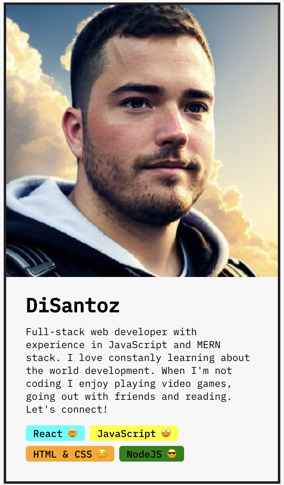

# react-portfolio-card

## Table of Contents

- [Usage](#usage)
- [Technologies](#technologies)
- [Install](#install)
- [License](#license)

## Usage

- Fun way to display your skillset and introduce yourself

## Technologies

- Creat React App
- Props and Components

## Install

This project was bootstrapped with [Create React App](https://github.com/facebook/create-react-app).

- Clone the repo and run `npm install` to install all `dependencies`

- Import you own profile photo, change `Line 2` of App.js as well as name in `Avatar` function

- Adjust and add your own skills and intro

- Feel free to change the css on `App.css` or use your own CSS

## License

MIT License

Copyright (c) 2023 DiSantoz

Permission is hereby granted, free of charge, to any person obtaining a copy
of this software and associated documentation files (the "Software"), to deal
in the Software without restriction, including without limitation the rights
to use, copy, modify, merge, publish, distribute, sublicense, and/or sell
copies of the Software, and to permit persons to whom the Software is
furnished to do so, subject to the following conditions:

The above copyright notice and this permission notice shall be included in all
copies or substantial portions of the Software.

THE SOFTWARE IS PROVIDED "AS IS", WITHOUT WARRANTY OF ANY KIND, EXPRESS OR
IMPLIED, INCLUDING BUT NOT LIMITED TO THE WARRANTIES OF MERCHANTABILITY,
FITNESS FOR A PARTICULAR PURPOSE AND NONINFRINGEMENT. IN NO EVENT SHALL THE
AUTHORS OR COPYRIGHT HOLDERS BE LIABLE FOR ANY CLAIM, DAMAGES OR OTHER
LIABILITY, WHETHER IN AN ACTION OF CONTRACT, TORT OR OTHERWISE, ARISING FROM,
OUT OF OR IN CONNECTION WITH THE SOFTWARE OR THE USE OR OTHER DEALINGS IN THE
SOFTWARE.
